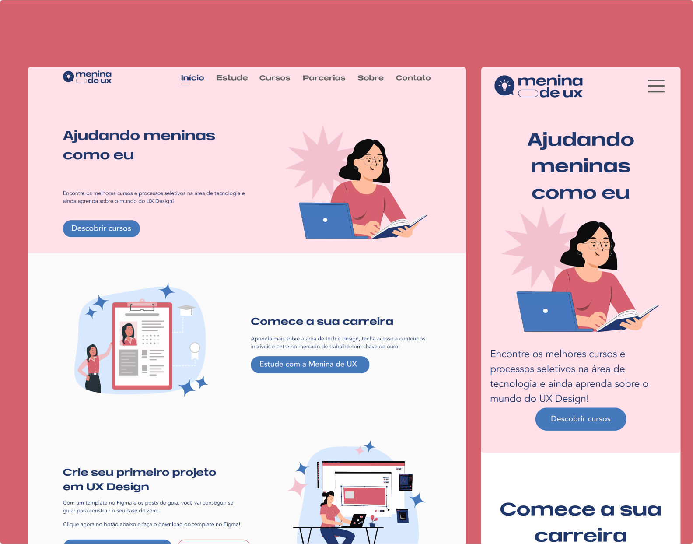

<div align="center" id="top">
  

&#xa0;

</div>

<h1 align="center">Site Menina de Ux</h1>

<!-- <h4 align="center">
	🚧   Under construction...  🚧
</h4> -->
<!-- <hr> -->

<p align="center">
  <a href="#-sobre">Sobre</a> &#xa0; | &#xa0;
  <a href="#-funcionalidades">Funcionalidades</a> &#xa0; | &#xa0;
  <a href="#-tecnologias">Tecnologias</a> &#xa0; | &#xa0;
  <a href="#-requisitos-para-rodar-a-aplicação">Requisitos</a> &#xa0; | &#xa0;
  <a href="#-contribuidores">Contribuidores</a>
</p>

<br>

## 🧠 Sobre

O projeto "Menina de UX" é uma iniciativa que visa promover a inclusão e a capacitação de mulheres na área de User Experience (UX) e Design de Interface (UI). Acreditamos no poder da diversidade e na importância de proporcionar oportunidades equitativas para que mulheres desenvolvam suas habilidades e carreiras nesse campo em constante evolução.

Nossa missão é oferecer recursos educacionais, mentorias e oportunidades de networking para mulheres interessadas em ingressar ou avançar em suas carreiras em UX/UI. Através de programas de capacitação e colaboração com profissionais experientes, buscamos criar um ambiente inclusivo e de apoio, onde todas as mulheres possam florescer e alcançar seu pleno potencial.

Além disso, o projeto "Menina de UX" é um espaço de aprendizado contínuo e inovação, onde exploramos e implementamos as mais recentes tecnologias e práticas de design. Ao colaborar em projetos significativos e desafiadores, as participantes têm a oportunidade de expandir seus horizontes e adquirir experiência prática em projetos do mundo real.

## 🔹 Paginas

- Home
- Estude
- Cursos
- Parcerias
- Sobre
- Contato
- Secao-de-voluntarias


### 🔹 As atividades do projeto:

- **Seleção das tecnologias**: Uma fase inicial crucial envolveu a escolha das tecnologias a serem utilizadas. Após cuidadosa análise e discussão, optamos por adotar Next.js, TypeScript e Tailwind CSS, visando uma combinação de eficiência, modernidade e escalabilidade.

- **Desenvolvimento do website**: O cerne do projeto foi a criação e aprimoramento do website da Menina de UX. Isso incluiu o design e implementação de uma interface atraente e funcional, garantindo uma experiência de usuário intuitiva e envolvente.

- **Colaboração e treinamento**: Uma ênfase significativa foi colocada na colaboração entre os membros da equipe e outros colaboradores, proporcionando um ambiente de aprendizado e crescimento mútuo. Workshops, sessões de treinamento e mentorias foram organizadas para oferecer suporte e orientação às participantes.

- **Testes e feedback**: Durante o desenvolvimento do website, foram conduzidos testes de usabilidade e coletado feedback dos usuários para identificar áreas de melhoria e garantir a qualidade do produto final. A iteração contínua e a adaptação às necessidades do público-alvo foram essenciais para o sucesso do projeto.


### 🔹 Os objetivos do projeto:

Durante o planejamento e execução do projeto, estabelecemos os seguintes objetivos claros e alcançáveis:

- Recriar o website da Menina de UX utilizando as tecnologias selecionadas, como Next.js, TypeScript e Tailwind CSS, visando uma experiência de usuário mais moderna e eficiente.

- Desenvolver um projeto que servisse como um portfólio para os voluntários envolvidos, oferecendo uma oportunidade valiosa para demonstrar suas habilidades e contribuições para a comunidade.

- Promover a colaboração entre os membros da equipe e outros colaboradores, incentivando o compartilhamento de conhecimento e experiência para alcançar os objetivos comuns.

### 🔹 Os resultados do projeto:

Durante o desenvolvimento deste projeto, obtivemos os seguintes resultados significativos:

- Implementação bem-sucedida das tecnologias escolhidas, incluindo Next.js, TypeScript e Tailwind CSS, demonstrando proficiência e adaptação a novas ferramentas.

- O projeto serviu como uma plataforma de aprendizado para todos os membros envolvidos, proporcionando oportunidades para expandir seus conhecimentos e habilidades em desenvolvimento web.

- Colaboração efetiva entre os membros da equipe e outros colaboradores, resultando em uma atmosfera de trabalho produtiva e engajada.

- A conclusão do projeto resultou em uma versão modernizada e aprimorada do website da Menina de UX, preparando-o para enfrentar os desafios atuais e futuros.


Links:

- [Site](https://menina-de-ux-website-modernization.vercel.app/)
- [Github](https://github.com/Menina-de-UX/menina-de-ux-website-modernization)

  <br/>

## 🛹 Funcionalidades

✔️ Carrossel de components generico com swiper

✔️ Server-componets

✔️ Patten-composition

✔️ Next13

✔️ Tailwind


<br/>

## 🚀 Tecnologias

Abaixo você poderá ter acesso às principais tecnologias usadas neste projeto

- [NextJS](https://nextjs.org/)
- [TypeScript](https://www.typescriptlang.org/)
- [Tailwind CSS](https://tailwindcss.com/)
- [chakra-ui](https://chakra-ui.com/)


## ✅ Requisitos para rodar a aplicação

Antes de iniciar 🏁, você precisa ter [Git](https://git-scm.com) e [Node](https://nodejs.org/en/) instalado em seu sistema operacional.

<br/>

## 🏁 Iniciando

```bash
# Clone este projeto
$ git clone https://github.com/Menina-de-UX/menina-de-ux-website-modernization
# Acesse
$ cd menina-de-ux-website-modernization
# Instale as dependências
$ yarn
# Execute o projeto
$ yarn start
# O projeto será inicializado em <http://localhost:3000>
```

<br/>

## ✨ Contribuidores
Obrigado a essas pessoas maravilhosas
<!-- ALL-CONTRIBUTORS-LIST:START - Do not remove or modify this section -->

<table>
  <tbody>
    <tr>
      <td align="center" valign="top" width="14.28%"><a href="https://github.com/alvesxdani"><br /><sub><b>Daniela Alves</b></sub></a><br /></td>
      <td align="center" valign="top" width="14.28%"><a href="https://github.com/ValeskaLeandro"><br /><sub><b>Valeska Leandro</b></sub></a></td>
      <td align="center" valign="top" width="14.28%"><a href="https://github.com/anaahnb"><br /><sub><b>Ana Júlia</b></sub></a></td>
      <td align="center" valign="top" width="14.28%"><a href="https://github.com/JacqueKajiya"><br /><sub><b>Jacqueline Kajiya</b></sub></a></td>
      <td align="center" valign="top" width="14.28%"><a href="https://github.com/taisoliva"><br /><sub><b>Taís Carvalho</b></sub></a><br /></td>
    </tr>
    <tr>
    <td align="center" valign="top" width="14.28%"><a href="https://github.com/lucivania-ventura"><br /><sub><b>Lucivania Ventura</b></sub></a></td>
      <td align="center" valign="top" width="14.28%"><a href="https://github.com/Marianaramosl"><br /><sub><b>Mariana Leão</b></sub></a></td>
      <td align="center" valign="top" width="14.28%"><a href="https://github.com/TayAmorim"><br /><sub><b>Tayanna Amorim</b></sub></a></td>
      <td align="center" valign="top" width="14.28%"><a href="https://github.com/LidSarti"><br /><sub><b>Lídia Sarti</b></sub></a></td>
      <td align="center" valign="top" width="14.28%"><a href="https://github.com/joaotelesk"><br /><sub><b>João Teles</b></sub></a>
    </tr>
 </tbody>
</table>
